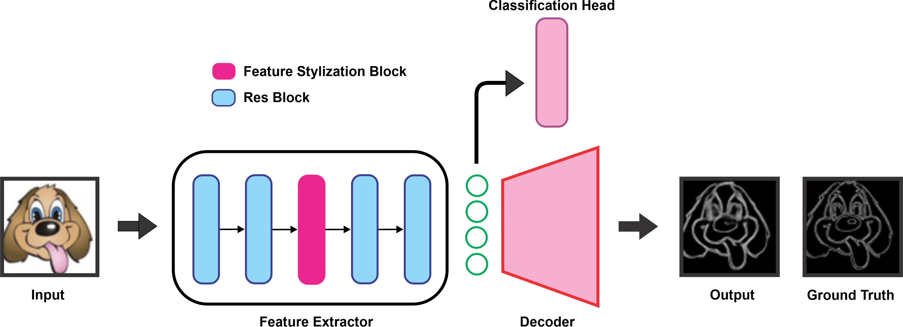

## Structure-Aware Feature Stylization for Domain Generalization

The official implementation of "Structure-Aware Feature Stylization for Domain Generalization".



Generalizing to out-of-distribution (OOD) data is a challenging task for existing deep learning approaches. This problem largely comes from the common but often incorrect assumption of statistical learning algorithms that the source and target data come from the same i.i.d. distribution. To tackle the limited variability of domains available during training, as well as domain shifts at test time, numerous approaches for domain generalization have focused on generating samples from new domains. Recent studies on this topic suggest that feature statistics from instances of different domains can be mixed to simulate synthesized images from a novel domain. While this simple idea achieves state-of-art results on various domain generalization benchmarks, it ignores structural information which is key to transferring knowledge across different domains. In this paper, we leverage the ability of humans to recognize objects using solely their structural information (prominent region contours) to design a Structural-Aware Feature Stylization method for domain generalization. Our method improves feature stylization based on mixing instance statistics by enforcing structural consistency across the different style-augmented samples. This is achieved via a multi-task learning model which classifies  original and augmented images while also reconstructing their edges in a secondary task. The edge reconstruction task helps the network preserve image structure during feature stylization, while also acting as a regularizer for the classification task. Through quantitative comparisons, we verify the effectiveness of our method upon existing state-of-the-art methods on two well-known benchmarks, PACS and Digits-DG.

### Requirements
- [pytorch 1.11.0](https://pytorch.org/)
- [torchvision 0.12.0](https://pytorch.org/)
- [numpy 1.22.3](https://numpy.org/)
- [opencv-python 4.5](https://github.com/skvark/opencv-python)
- [scikit-learn 1.0.2](https://scikit-learn.org/)


### Usage
1- Clone the repository

2- Install the requirements
```
pip3 install -r /path/to/requirements.txt 
```
3- Download the PACS and/or Digits-DG dataset and extract them

4- Create a config file of interest (the default config files used in the paper are located in `configs` directory)

For example, the config file to train our proposed method on PACS dataset (`./configs/pacs/art.json`):
```
{
  "data_path" : "path/to/pacs/dataset",
  "domains" : ["art_painting", "cartoon", "photo", "sketch"],
  "test_domain" : "art_painting",
  "backbone" : "resnet18",
  "batch_size" : 64,
  "num_epochs" : 500,
  "num_workers" : 5,
  "reconstruction" : true,
  "feature_stylization" : true,
  "save_path": "where/to/save",
  "lmda_value" : 1,
  "p_value" : 0.1,
  "lr" : 0.01
}
```

`data_path` shows the location of the dataset. `domains` indicates the name of the domains exist in the dataset for example `["art_painting", "cartoon", "photo", "sketch"]` for PACS dataset or `["MNIST", "MNIST-M", "SVHN", "SYN"]` for Digits-DG dataset. `test_domain` is the name of the held-out domain used for test time and remaining domains are used for training. `backbone` can be any variant of ResNet. `reconstruction` is to whether use a decoder to recounstruct edges. `feature_stylization` whether to apply the featyre stylization in the encoder. `lmda_value` is the weight of Structural Sonsistency Loss (eq. 3 in the paper). `p_value` is the probability of applying feature stylization for each input image.    

5- To run the training:
```
python3 main.py -config 'path/to/the/config.json'
```


### Results on PACS dataset

Comparison of our method with previous SOTA methods on the PACS dataset:

| Method   | Art          | Cartoon      | Photo        | Sketch       | Avg   |
|----------|--------------|--------------|--------------|--------------|-------|
| D-SAM    | 77.33        | 72.43        | 95.30        | 77.83        | 80.72 |
| MetaReg  | 83.70        | 77.20        | 95.50        | 70.30        | 81.68 |
| JiGen    | 79.42        | 75.25        | 96.03        | 71.35        | 80.51 |
| MASF     | 80.29        | 77.17        | 94.99        | 71.69        | 81.04 |
| Epi-FCR  | 82.10        | 77.00        | 93.90        | 73.00        | 81.50 |
| InfoDrop | 80.27        | 76.54        | 96.11        | 76.38        | 82.33 |
| DMG      | 76.90        | 80.38        | 93.35        | 75.21        | 81.46 |
| EISNet   | 81.89        | 76.44        | 95.93        | 74.33        | 82.15 |
| L2A-OT   | 83.30        | 78.20        | 96.20        | 73.60        | 82.83 |
| DSON     | 84.67        | 77.65        | 95.87        | 82.23        | 85.11 |
| RSC      | 83.43        | 80.31        | 95.99        | 80.85        | 85.15 |
| MixStyle | 84.10        | 78.80        | 96.10        | 75.90        | 83.73 |
| pAdaIN   | 81.74        | 76.91        | 96.29        | 75.13        | 82.52 |
| FSDCL     | 85.30        | **81.31**    | 95.63        | 81.19        | 85.86 |
| SWAD     | 83.49        | 75.68    | 95.83        | 76.72        | 82.93 |
| DNA     | 83.02        | 76.69    | 95.88       | 76.59       | 83.05 |
| Ours     | **85.53 ± 0.14** | 79.89 ± 0.97** | **96.75 ± 0.45** | **82.28 ± 1.04** | **86.11** |


